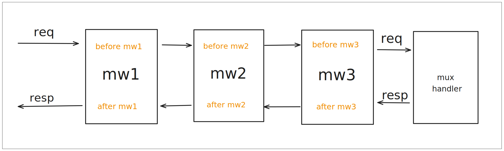

## 1.下载

httpz需要你的Go版本为1.22+。我们先创建并初始化一个名为helloworld的Go项目:

```sh
mkdir helloworld && cd helloworld
go mod init helloworld
```

下载 httpz:

```sh
go get github.com/aeilang/httpz@latest
```

在当前目录创建`main.go`文件：

```go filename="main.go"
package main

import (
	"log"
	"net/http"

	"github.com/aeilang/httpz"
)

func main() {
	mux := httpz.NewServeMux()

	mux.Get("/hello", helloHandler)

	log.Fatal(http.ListenAndServe(":8080", mux))
}

func helloHandler(w http.ResponseWriter, r *http.Request) error {
		w.Write([]byte("hello httpz"))
		return nil
}
```

运行服务：

```sh
go run main.go
```

访问 <span className="text-sky-300">http://localhost:8080/hello</span>
，你将会在浏览器上看到`hello httpz`

## 2.返回错误

你可以看到，helloHandler返回error:

```go
func helloHandler(w http.ResponseWriter, r *http.Request) error {
	w.Write([]byte("hello httpz"))
	return nil
}
```

考虑下面的例子：

```go filename="main.go"
// ...

func helloHandler(w http.ResponseWriter, r *http.Request) error {
    // 获取请求参数name
	name := r.URL.Query().Get("name")

	if name == "" {
		return httpz.NewHTTPError(http.StatusBadRequest, "name is required")
	}

	fmt.Fprintf(w, "hello %s\n", name)
	return nil
}
```

访问<span className="text-sky-300">http://localhost:8080/hello</span>
, 这时name为空字符串，你将会看到:`{"msg":"name is required"}`,这是我们默认的错误处理函数返回的响应。

访问<span className="text-sky-300">http://localhost:8080/hello?name=lihua</span>，这时name=lihua,
你将会看到: `hello lihua`。

## 3.路由

除了GET,你还可以使用其他请求方法，例如，POST, PUT, PATCH, DELETE等

```go 
mux.Post("/books", createBook)
mux.Get("/books", getBooks)
mux.Put("/books/{id}", updateBook)
mux.Delete("/books/{id}", deleteBook)
```

## 4.数据绑定

### 路径参数

1. 使用net/http的`r.PathValue`函数获取:

```go filename="main.go"
package main

import (
	"log"
	"net/http"

	"github.com/aeilang/httpz"
)

func main() {
	mux := httpz.NewServeMux()

	mux.Get("/books/{id}", getBook)

	log.Fatal(http.ListenAndServe(":8080", mux))
}

func getBook(w http.ResponseWriter, r *http.Request) error {
	id := r.PathValue("id")
	w.Write([]byte(id))
	return nil
}
```

访问<span className="text-sky-300">http://localhost:8080/books/1</span>
你将会看到`1`。

2. 使用`httpz.BindPathParams`函数

```go filename="main.go" {4,8-9}
// ...

type Book struct {
	ID int `param:"id"` // 知道路径参数名为id
}

func getBook(w http.ResponseWriter, r *http.Request) error {
	var b Book
	if err := httpz.BindPathParams(r, &b); err != nil {
		return err
	}

	fmt.Fprintf(w, "%d", b.ID)
	return nil
}
```

结果是一样的。这种方法能自动反序列化为对应的类型。当路径参数有多个，或需要我们手动转化类型时很有用，例如：
`mux.Get("/books/{id}/{author_id}", getBook)`。

### 请求参数

1. 使用`httpz.BindQueryParams`函数 

```go {4-5,11}
// ...

type User struct {
	Name string `query:"name"` // 使用query标签绑定请求参数
	Age  int    `query:"age"`
}

// mux.Get("/user", getUser)
func getUser(w http.ResponseWriter, r *http.Request) error {
	var u User
	if err := httpz.BindQueryParams(r, &u); err != nil {
		return err
	}

	return json.NewEncoder(w).Encode(u)
}
```

访问<span className="text-sky-300">http://localhost:8080/user?name=lihua&age=18</span>
你将会看到`{"Name":"lihua","Age":18}`。

2. 使用net/http, `r.URL.Query函数`.

```go {5-7}
// ...

// mux.Get("/user", getUser)
func getUser(w http.ResponseWriter, r *http.Request) error {
	vals := r.URL.Query()
	name := vals.Get("name")
	age  := vals.Get("age")

	ageInt, err := strconv.Atoi(age)
	if err != nil {
		return httpz.NewHTTPError(http.StatusBadRequest, "age must be int")
	}

	u := User{
		Name: name,
		Age:  ageInt,
	}

	return json.NewEncoder(w).Encode(u)
}
```
结果是一样的。

### 表单参数 

#### application/x-www-form-urlencoded

1. 使用 httpz.BindBody函数

```go {2-3,9}
type User struct {
	Name string `form:"name"` // 使用form标签绑定表单参数
	Age  int    `form:"age"`
}

// mux.Post("/user", createUser)
func createUser(w http.ResponseWriter, r *http.Request) error {
	var u User
	if err := httpz.BindBody(r, &u); err != nil {
		return err
	}

	return json.NewEncoder(w).Encode(u)
}
```

在命令行输入下列POST请求：

```sh
curl -d "name=lihua" -d "age=18" http://localhost:8080/user
```
打印：

```
{"Name":"lihua","Age":18}
```

2. 使用net/http, r.FormValue函数

```go {3-4}
// mux.Post("/user", createUser)
func createUser(w http.ResponseWriter, r *http.Request) error {
	name := r.FormValue("name")
	age := r.FormValue("age")
	ageInt, err := strconv.Atoi(age)
	if err != nil {
		return httpz.NewHTTPError(http.StatusBadRequest, "age must be int")
	}

	u := User{
		Name: name,
		Age:  ageInt,
	}

	return json.NewEncoder(w).Encode(u)
}
```
结果是一样的。

#### Form multipart/form-data

绑定文件直接使用net/http, r.FormFile函数

```go {6}
// mux.Post("/file", saveFile)
func saveFile(w http.ResponseWriter, r *http.Request) error {
	// 限制最大上传文件大小（可选）
	r.ParseMultipartForm(10 << 20) // 10 MB

	// 获取上传的文件
	file, header, err := r.FormFile("file")
	if err != nil {
		return httpz.NewHTTPError(http.StatusBadRequest, "failed to get file")
	}
	defer file.Close()

	// ... save file

	return nil
}
```

### json数据

1. 使用httpz.BindBody函数，底层使用json标准库来反序列化。

```go {2-3,9}
type User struct {
	Name string `json:"name"` // 使用json标签绑定json数据，标准库语法
	Age  int    `json:"age"`
}

// mux.Post("/user", createUser)
func createUser(w http.ResponseWriter, r *http.Request) error {
	var u User
	if err := httpz.BindBody(r, &u); err != nil {
		return err
	}

	return json.NewEncoder(w).Encode(u)
}
```

命令行输入下列POST请求：
```sh
curl -X POST -H "Content-Type: application/json" -d '{"name": "lihua", "age": 18}' http://localhost:8080/user
```

xml数据也是如此

### httpz.Bind 函数

可以指定多个参数来源：

```go
type User struct {
	Name string `param:"name" query:"name" form:"name" xml:"name" json:"name"`
	Age  int    `param:"age" query:"age" form:"age" xml:"age" json:"age"`
}
```

httpz.Bind,会自动调用httpz.BindPathParams, httpz.BindQueryParams, httpz.BindBody进行解析

```go {4}
// mux.Post("/user", createUser)
func createUser(w http.ResponseWriter, r *http.Request) error {
	var u User
	if err := httpz.Bind(r, &u); err != nil {
		return err
	}

	return json.NewEncoder(w).Encode(u)
}
```

## 5.分组

使用 mux.Group函数进行分组。

```go filename="main.go" {4,10}
func main() {
	mux := httpz.NewServeMux()

	v1 := mux.Group("/v1/")
	v1.Get("/user", func(w http.ResponseWriter, r *http.Request) error {
		w.Write([]byte("from /v1/user"))
		return nil
	})

	v2 := mux.Group("/v2/")
	v2.Get("/user", func(w http.ResponseWriter, r *http.Request) error {
		w.Write([]byte("from /v2/user"))
		return nil
	})

	log.Fatal(http.ListenAndServe(":8080", mux))
}
```
请注意，`/v1/`后面的`/`是必须的，这是`http.Handle`的语法,表示把以`/v1`开头的的请求都转发到v1处理。

## 6.中间件

httpz有两种中间件，handlerMiddleware和routeMiddleware

### HandlerMiddleware

函数签名为:

```go
type MiddlewareFunc func(next http.Handler) http.Handler
```

chi的中间件就是就是这样的签名,我们直接使用日志中间件Logger:

```go filename="main.go" {13}
package main

import (
	"log"
	"net/http"

	"github.com/aeilang/httpz"
	"github.com/aeilang/httpz/middleware"
)

func main() {
	mux := httpz.NewServeMux()
	mux.Use(middleware.Logger)

	v1 := mux.Group("/v1/")
	v1.Get("/user", func(w http.ResponseWriter, r *http.Request) error {
		w.Write([]byte("from /v1/user"))
		return nil
	})

	v2 := mux.Group("/v2/")
	v2.Get("/user", func(w http.ResponseWriter, r *http.Request) error {
		w.Write([]byte("from /v2/user"))
		return nil
	})

	log.Fatal(http.ListenAndServe(":8080", mux))
}
```

现在就有打印日志的功能了。

中间件使用了装饰器模式。

定义三个中间件：

```go filename="main.go"
func mw1(next http.Handler) http.Handler {
	fn := func(w http.ResponseWriter, r *http.Request) {
		log.Println("before mw1")
		next.ServeHTTP(w, r)
		log.Println("after mw1")
	}

	return http.HandlerFunc(fn)
}

func mw2(next http.Handler) http.Handler {
	fn := func(w http.ResponseWriter, r *http.Request) {
		log.Println("before mw2")
		next.ServeHTTP(w, r)
		log.Println("after mw2")
	}

	return http.HandlerFunc(fn)
}

func mw3(next http.Handler) http.Handler {
	fn := func(w http.ResponseWriter, r *http.Request) {
		log.Println("before mw3")
		next.ServeHTTP(w, r)
		log.Println("after mw3")
	}

	return http.HandlerFunc(fn)
}
```

它们分别给handler的前后打印信息。

可以在mux.Use()函数中传入多个中间件。

```go filename="main.go" {3}
func main() {
	mux := httpz.NewServeMux()
	mux.Use(mw1, mw2, mw3)

	mux.Get("/hello", func(w http.ResponseWriter, r *http.Request) error {
		w.Write([]byte("hello world"))
		return nil
	})
	log.Fatal(http.ListenAndServe(":8080", mux))
}
```

访问<span className="text-sky-300">http://localhost:8080/hello</span>
你将会看到`hello world`。

返回命令行，打印了如下日志：

```
2025/01/15 02:49:17 before mw1
2025/01/15 02:49:17 before mw2
2025/01/15 02:49:17 before mw3
2025/01/15 02:49:17 after mw3
2025/01/15 02:49:17 after mw2
2025/01/15 02:49:17 after mw1
```

访问路径如下图：



### RouteMiddleware

函数签名为：

```go {2}
type HandlerFunc func(w http.ResponseWriter, r *http.Request) error
type RouteMiddlewareFunc func(next HandlerFunc) HandlerFunc
```

我们可以为每个路由添加中间件，例如

定义一个RouteMiddleware

```go
func routeMW(next httpz.HandlerFunc) httpz.HandlerFunc {
	return func(w http.ResponseWriter, r *http.Request) error {
		log.Println("before routeMW")
		err := next(w, r)
		log.Println("after routeMW")
		return err
	}
}
```
你可以在路由后面添加任意多个路由中间件：

```go {3}
func main() {
	mux := httpz.NewServeMux()
	mux.Get("/hello", helloHandler, routeMW)
	log.Fatal(http.ListenAndServe(":8080", mux))
}

func helloHandler(w http.ResponseWriter, r *http.Request) error {
	w.Write([]byte("hello world"))
	return nil
}
```
访问<span className="text-sky-300">http://localhost:8080/hello</span>
你将会看到`hello world`。

返回命令行，打印了如下日志：

```
2025/01/15 03:15:22 before routeMW
2025/01/15 03:15:22 after routeMW
```
原理和HandlerMiddleware一样。
