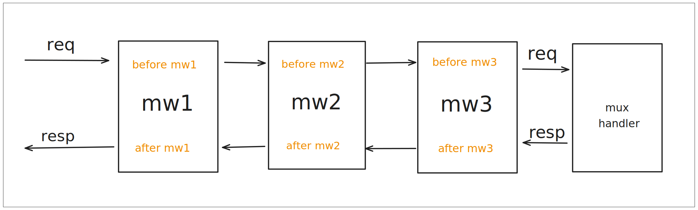

## 1. Download

httpz requires your Go version to be 1.22 or higher. Let's create and initialize a Go project named `helloworld`:

```sh
mkdir helloworld && cd helloworld
go mod init helloworld
```

Download httpz:

```sh
go get github.com/aeilang/httpz@latest
```

Create a `main.go` file in the current directory:

```go filename="main.go"
package main

import (
	"log"
	"net/http"

	"github.com/aeilang/httpz"
)

func main() {
	mux := httpz.NewServeMux()

	mux.Get("/hello", helloHandler)

	log.Fatal(http.ListenAndServe(":8080", mux))
}

func helloHandler(w http.ResponseWriter, r *http.Request) error {
		w.Write([]byte("hello httpz"))
		return nil
}
```

Run the server:

```sh
go run main.go
```

Visit <span className="text-sky-300">http://localhost:8080/hello</span> and you will see `hello httpz` in your browser.

## 2. Return Errors

As you can see, `helloHandler` returns an error:

```go {3}
func helloHandler(w http.ResponseWriter, r *http.Request) error {
	w.Write([]byte("hello httpz"))
	return nil
}
```

Consider the following example:

```go filename="main.go"
// ...

// mux.Get("hello", helloHandler)
func helloHandler(w http.ResponseWriter, r *http.Request) error {
    // Get the request parameter name
	name := r.URL.Query().Get("name")

	if name == "" {
		return httpz.NewHTTPError(http.StatusBadRequest, "name is required")
	}

	fmt.Fprintf(w, "hello %s\n", name)
	return nil
}
```

Visit <span className="text-sky-300">http://localhost:8080/hello</span>, and if `name` is an empty string, you will see: `{"msg":"name is required"}`, which is the response from our default error handler.

Visit <span className="text-sky-300">http://localhost:8080/hello?name=lihua</span>, and with `name=lihua`, you will see: `hello lihua`.

## 3. Routing

Besides GET, you can use other request methods like POST, PUT, PATCH, DELETE, etc.

```go
mux.Post("/books", createBook)
mux.Get("/books", getBooks)
mux.Put("/books/{id}", updateBook)
mux.Delete("/books/{id}", deleteBook)
```

## 4. Data Binding

### Path Parameters

1. Use the `r.PathValue` function from `net/http`:

```go filename="main.go"
package main

import (
	"log"
	"net/http"

	"github.com/aeilang/httpz"
)

func main() {
	mux := httpz.NewServeMux()

	mux.Get("/books/{id}", getBook)

	log.Fatal(http.ListenAndServe(":8080", mux))
}

func getBook(w http.ResponseWriter, r *http.Request) error {
	id := r.PathValue("id")
	w.Write([]byte(id))
	return nil
}
```

Visit <span className="text-sky-300">http://localhost:8080/books/1</span> and you will see `1`.

2. Use the `httpz.BindPathParams` function

```go filename="main.go" {4,8-9}
// ...

type Book struct {
	ID int `param:"id"` // Knows the path parameter name is id
}

func getBook(w http.ResponseWriter, r *http.Request) error {
	var b Book
	if err := httpz.BindPathParams(r, &b); err != nil {
		return err
	}

	fmt.Fprintf(w, "%d", b.ID)
	return nil
}
```

The result is the same. This method can automatically deserialize to the corresponding type. It's useful when there are multiple path parameters or when we need to manually convert types, for example: `mux.Get("/books/{id}/{author_id}", getBook)`.

### Request Parameters

1. Use the `httpz.BindQueryParams` function

```go {4-5,11}
// ...

type User struct {
	Name string `query:"name"` // Bind request parameters using the query tag
	Age  int    `query:"age"`
}

// mux.Get("/user", getUser)
func getUser(w http.ResponseWriter, r *http.Request) error {
	var u User
	if err := httpz.BindQueryParams(r, &u); err != nil {
		return err
	}

	return json.NewEncoder(w).Encode(u)
}
```

Visit <span className="text-sky-300">http://localhost:8080/user?name=lihua&age=18</span> and you will see `{"Name":"lihua","Age":18}`.

2. Use `net/http`, `r.URL.Query` function.

```go {5-7}
// ...

// mux.Get("/user", getUser)
func getUser(w http.ResponseWriter, r *http.Request) error {
	vals := r.URL.Query()
	name := vals.Get("name")
	age  := vals.Get("age")

	ageInt, err := strconv.Atoi(age)
	if err != nil {
		return httpz.NewHTTPError(http.StatusBadRequest, "age must be int")
	}

	u := User{
		Name: name,
		Age:  ageInt,
	}

	return json.NewEncoder(w).Encode(u)
}
```

The result is the same.

### Form Parameters

#### application/x-www-form-urlencoded

1. Use the `httpz.BindBody` function

```go {2-3,9}
type User struct {
	Name string `form:"name"` // Bind form parameters using the form tag
	Age  int    `form:"age"`
}

// mux.Post("/user", createUser)
func createUser(w http.ResponseWriter, r *http.Request) error {
	var u User
	if err := httpz.BindBody(r, &u); err != nil {
		return err
	}

	return json.NewEncoder(w).Encode(u)
}
```

Enter the following POST request in the command line:

```sh
curl -d "name=lihua" -d "age=18" http://localhost:8080/user
```

Prints:

```
{"Name":"lihua","Age":18}
```

2. Use `net/http`, `r.FormValue` function

```go {3-4}
// mux.Post("/user", createUser)
func createUser(w http.ResponseWriter, r *http.Request) error {
	name := r.FormValue("name")
	age := r.FormValue("age")
	ageInt, err := strconv.Atoi(age)
	if err != nil {
		return httpz.NewHTTPError(http.StatusBadRequest, "age must be int")
	}

	u := User{
		Name: name,
		Age:  ageInt,
	}

	return json.NewEncoder(w).Encode(u)
}
```

The result is the same.

#### Form multipart/form-data

Bind files directly using `net/http`, `r.FormFile` function

```go {6}
// mux.Post("/file", saveFile)
func saveFile(w http.ResponseWriter, r *http.Request) error {
	// Limit the maximum upload file size (optional)
	r.ParseMultipartForm(10 << 20) // 10 MB

	// Get the uploaded file
	file, header, err := r.FormFile("file")
	if err != nil {
		return httpz.NewHTTPError(http.StatusBadRequest, "failed to get file")
	}
	defer file.Close()

	// ... save file

	return nil
}
```

### JSON Data

1. Use the `httpz.BindBody` function, which uses the standard JSON library for deserialization.

```go {2-3,9}
type User struct {
	Name string `json:"name"` // Bind JSON data using the json tag, standard library syntax
	Age  int    `json:"age"`
}

// mux.Post("/user", createUser)
func createUser(w http.ResponseWriter, r *http.Request) error {
	var u User
	if err := httpz.BindBody(r, &u); err != nil {
		return err
	}

	return json.NewEncoder(w).Encode(u)
}
```

Enter the following POST request in the command line:

```sh
curl -X POST -H "Content-Type: application/json" -d '{"name": "lihua", "age": 18}' http://localhost:8080/user
```

XML data is handled similarly.

### httpz.Bind Function

You can specify multiple parameter sources:

```go
type User struct {
	Name string `param:"name" query:"name" form:"name" xml:"name" json:"name"`
	Age  int    `param:"age" query:"age" form:"age" xml:"age" json:"age"`
}
```

`httpz.Bind` will automatically call `httpz.BindPathParams`, `httpz.BindQueryParams`, and `httpz.BindBody` for parsing.

```go {4}
// mux.Post("/user", createUser)
func createUser(w http.ResponseWriter, r *http.Request) error {
	var u User
	if err := httpz.Bind(r, &u); err != nil {
		return err
	}

	return json.NewEncoder(w).Encode(u)
}
```

## 5. Grouping

Use the `mux.Group` function for grouping.

```go filename="main.go" {4,10}
func main() {
	mux := httpz.NewServeMux()

	v1 := mux.Group("/v1/")
	v1.Get("/user", func(w http.ResponseWriter, r *http.Request) error {
		w.Write([]byte("from /v1/user"))
		return nil
	})

	v2 := mux.Group("/v2/")
	v2.Get("/user", func(w http.ResponseWriter, r *http.Request) error {
		w.Write([]byte("from /v2/user"))
		return nil
	})

	log.Fatal(http.ListenAndServe(":8080", mux))
}
```

Note that the `/v1/` trailing `/` is required. This is the syntax of `http.Handle`, indicating that requests starting with `/v1` are forwarded to the v1 handler.

## 6. Middleware

httpz has two types of middleware: `handlerMiddleware` and `routeMiddleware`.

### HandlerMiddleware

The function signature is:

```go
type MiddlewareFunc func(next http.Handler) http.Handler
```

The middleware in chi has this signature, and we can directly use the logging middleware `Logger`:

```go filename="main.go" {13}
package main

import (
	"log"
	"net/http"

	"github.com/aeilang/httpz"
	"github.com/aeilang/httpz/middleware"
)

func main() {
	mux := httpz.NewServeMux()
	mux.Use(middleware.Logger)

	v1 := mux.Group("/v1/")
	v1.Get("/user", func(w http.ResponseWriter, r *http.Request) error {
		w.Write([]byte("from /v1/user"))
		return nil
	})

	v2 := mux.Group("/v2/")
	v2.Get("/user", func(w http.ResponseWriter, r *http.Request) error {
		w.Write([]byte("from /v2/user"))
		return nil
	})

	log.Fatal(http.ListenAndServe(":8080", mux))
}
```

Now it has logging functionality.

Middleware uses the decorator pattern.

Define three middlewares:

```go filename="main.go"
func mw1(next http.Handler) http.Handler {
	fn := func(w http.ResponseWriter, r *http.Request) {
		log.Println("before mw1")
		next.ServeHTTP(w, r)
		log.Println("after mw1")
	}

	return http.HandlerFunc(fn)
}

func mw2(next http.Handler) http.Handler {
	fn := func(w http.ResponseWriter, r *http.Request) {
		log.Println("before mw2")
		next.ServeHTTP(w, r)
		log.Println("after mw2")
	}

	return http.HandlerFunc(fn)
}

func mw3(next http.Handler) http.Handler {
	fn := func(w http.ResponseWriter, r *http.Request) {
		log.Println("before mw3")
		next.ServeHTTP(w, r)
		log.Println("after mw3")
	}

	return http.HandlerFunc(fn)
}
```

They print information before and after the handler.

You can pass multiple middlewares in the `mux.Use()` function.

```go filename="main.go" {3}
func main() {
	mux := httpz.NewServeMux()
	mux.Use(mw1, mw2, mw3)

	mux.Get("/hello", func(w http.ResponseWriter, r *http.Request) error {
		w.Write([]byte("hello world"))
		return nil
	})
	log.Fatal(http.ListenAndServe(":8080", mux))
}
```

Visit <span className="text-sky-300">http://localhost:8080/hello</span> and you will see `hello world`.

Return to the command line, and the following logs are printed:

```
2025/01/15 02:49:17 before mw1
2025/01/15 02:49:17 before mw2
2025/01/15 02:49:17 before mw3
2025/01/15 02:49:17 after mw3
2025/01/15 02:49:17 after mw2
2025/01/15 02:49:17 after mw1
```

The path of access is shown below:



### RouteMiddleware

The function signature is:

```go {2}
type HandlerFunc func(w http.ResponseWriter, r *http.Request) error
type RouteMiddlewareFunc func(next HandlerFunc) HandlerFunc
```

We can add middleware to each route, for example:

Define a `RouteMiddleware`:

```go
func routeMW(next httpz.HandlerFunc) httpz.HandlerFunc {
	return func(w http.ResponseWriter, r *http.Request) error {
		log.Println("before routeMW")
		err := next(w, r)
		log.Println("after routeMW")
		return err
	}
}
```

You can add any number of route middlewares after the route:

```go {3}
func main() {
	mux := httpz.NewServeMux()
	mux.Get("/hello", helloHandler, routeMW)
	log.Fatal(http.ListenAndServe(":8080", mux))
}

func helloHandler(w http.ResponseWriter, r *http.Request) error {
	w.Write([]byte("hello world"))
	return nil
}
```

Visit <span className="text-sky-300">http://localhost:8080/hello</span> and you will see `hello world`.

Return to the command line, and the following logs are printed:

```
2025/01/15 03:15:22 before routeMW
2025/01/15 03:15:22 after routeMW
```

The principle is the same as `HandlerMiddleware`.

## 7. Response

You can use httpz.NewHelperRW to easily send responses.

```go {8-9}
// mux.Get("/user", getUser)
func getUser(w http.ResponseWriter, r *http.Request) error {
	u := User{
		Name: "lihua",
		Age:  18,
	}

	hw := httpz.NewHelperRW(w)
	return hw.JSON(http.StatusOK, u)
}
```

The above code is equivalent to:

```go {8-10}
// mux.Get("/user", getUser)
func getUser(w http.ResponseWriter, r *http.Request) error {
	u := User{
		Name: "lihua",
		Age:  18,
	}

	w.Header().Set("Content-Type", "application/json")
	w.WriteHeader(http.StatusOK)
	return json.NewEncoder(w).Encode(u)
}
```

Besides the `JSON` method, there are other convenient methods available:

```go
hw.JSON()
hw.String()
hw.XML()
hw.HTML()
```
